# DBMason user guide

DBMason uses one Payload + Next.js process, SQLite for local control-plane
metadata, and short-lived PostgreSQL or MySQL connections for live inventory
and management. Each managed server remains the source of truth for its
databases, principals, and grants.

The screenshots in this guide are credential-free. The production captures were taken from the non-root Docker image; the focused form captures show the same UI in the isolated app-test environment. Test-only database, role, query, and row values may be visible, but no generated or saved password is included.

## 1. Configure the application

Run commands from the repository root. Create `.env` only when it does not already exist:

```bash
test -f .env || cp .env.example .env
```

Set these values:

```dotenv
PORT=3010
DATABASE_URL=file:./data/control-plane.db
PAYLOAD_SECRET=<at-least-32-random-characters>
CONNECTION_ENCRYPTION_KEY=<64-hex-characters>
DATABASE_HOST_ALLOWLIST=
DBMASON_SOURCE_URL=
```

Generate independent secrets with `openssl rand -base64 48` and `openssl rand -hex 32`. Keep `.env` and SQLite files out of source control. Set `DATABASE_HOST_ALLOWLIST` to exact hosts or deliberate wildcard domains in production. Official builds derive their corresponding-source link from the package version; a modified network build must set runtime `DBMASON_SOURCE_URL` to its public source for AGPL users.

`PORT` is read when the process starts. Change it and restart when that port is already occupied; do not kill an unknown process without first verifying its PID and working directory.

## 2. Start DBMason

For local development:

```bash
pnpm install
pnpm dev
```

For the single-container production build:

```bash
docker compose up --build -d
```

The container runs as a non-root user, stores SQLite in the `db-control-data` volume, and publishes its internal port `3000` on the host `PORT` from `.env`. Run one replica while SQLite is the control-plane database.

For a disposable local PostgreSQL target, follow the [test harness guide](POSTGRES_TEST_HARNESS.md):

```bash
test -f .env.postgres-test || cp .env.postgres-test.example .env.postgres-test
pnpm postgres:test:config
pnpm postgres:test:up
pnpm postgres:test:status
```

For an isolated MySQL 8.4 target, follow the separate
[MySQL harness guide](MYSQL_TEST_HARNESS.md):

```bash
test -f .env.mysql-test || cp .env.mysql-test.example .env.mysql-test
pnpm mysql:test:config
pnpm mysql:test:up
pnpm mysql:test:status
```

## 3. Create the first owner

Open the configured application URL. A new control plane shows one bootstrap action:

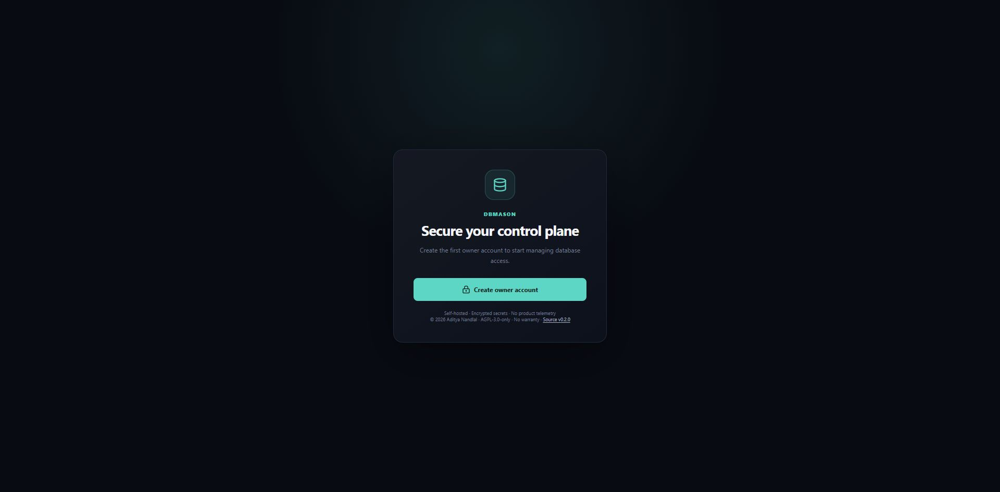

1. Select **Create owner account**.
2. Enter a unique email, strong password, and display name.
3. Submit once. Concurrent bootstrap attempts are serialized, and only the first account becomes the initial owner.

Payload Admin then exposes Users, Database Connections, Access Profiles, and Audit Events:

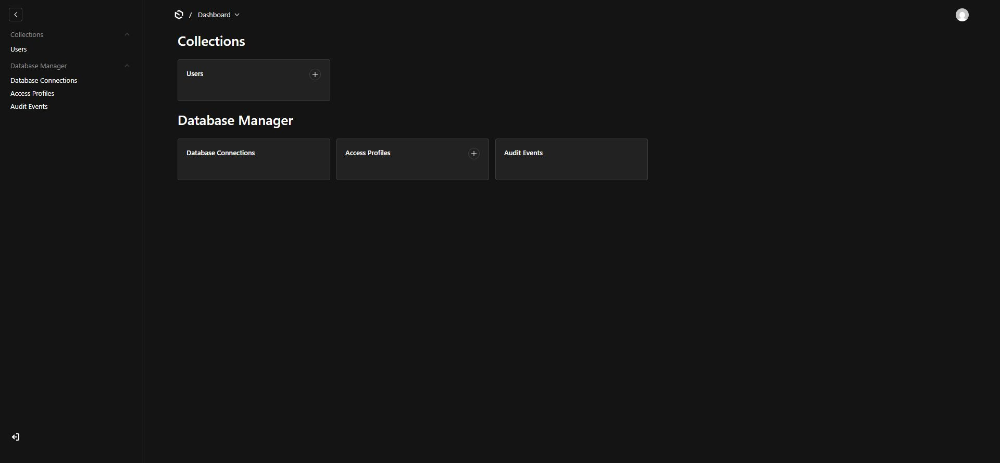

Use separate DBMason accounts for people. Do not share a managed-database administrator credential.

## 4. Add PostgreSQL or MySQL

1. Return to the product UI and select **Add connection**.
2. Choose the engine, then enter a display name, host, port, maintenance database, administrator username, and password. PostgreSQL defaults to port `5432` and database `postgres`; MySQL defaults to `3306` and `mysql`.
3. Choose TLS deliberately:
   - **Verify certificate** is the default and validates encryption, certificate trust, and hostname.
   - **Require TLS** encrypts without verifying server identity.
   - **Legacy prefer** tries TLS and may fall back to plaintext only when the server explicitly does not support TLS.
   - **Disabled** is for a trusted local target such as the loopback test harness.
4. Select **Test & save**.

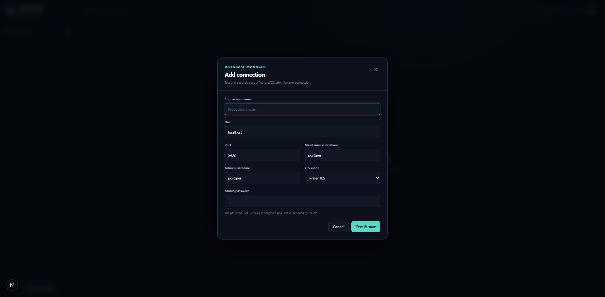

The password is encrypted with AES-256-GCM before it reaches SQLite and is never returned by the connection API. A successful save loads that server's live catalog. The retained production screenshots document the PostgreSQL flow:

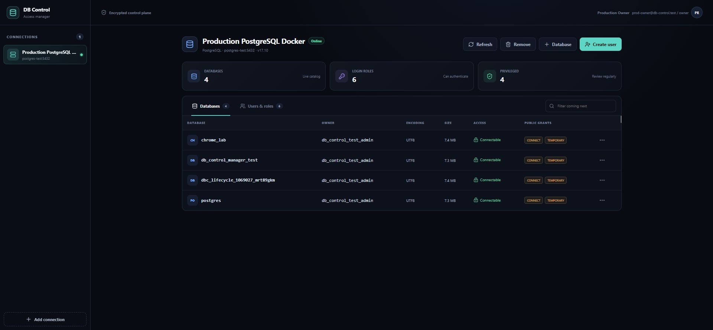

A DBMason container cannot reach a host-published database port through its own `127.0.0.1`. Give containers deliberate network routing or use an approved host gateway/DNS name, and include that name in `DATABASE_HOST_ALLOWLIST`.

The saved MySQL administrator username is the login user component. Managed
MySQL principals use complete `user@host` identities, such as
`app_reader@db.internal` or the deliberate `app_reader@%`. Partial host
wildcards are rejected. A `%` account needs especially strict TLS, firewall,
bind, and network policy.

## 5. Inspect engine-native observability

Open **Observability** for the selected connection. DBMason collects one on-demand, read-only PostgreSQL statistics snapshot when the tab opens and when you select **Refresh metrics**; it does not poll the server in the background.

The page shows:

- observed connections versus PostgreSQL's configured maximum and reserved slots
- active, idle, lock-blocked, waiting, and long-running session counts
- primary/replica mode and server uptime
- per-database cumulative commits/rollbacks, PostgreSQL buffer-cache hit ratio, temporary bytes/files, deadlocks, and size
- PostgreSQL 17 `pg_stat_io` physical reads, writes, cache hits, evictions, writebacks, extends, fsyncs, and buffer reuses
- cumulative `pg_stat_io` read, write, and fsync timing when `track_io_timing` is enabled
- whether activity and database counters are enabled

These are native PostgreSQL statistics. They can lag by about one second, and cumulative counters are totals since the PostgreSQL statistics reset—not transactions per second. I/O timing is marked unavailable when `track_io_timing` is disabled.

Full cross-session activity needs the saved PostgreSQL management role to be a superuser or inherit `pg_read_all_stats`. When it does not, DBMason shows **Restricted** instead of misleading zeroes. Grant `pg_read_all_stats` only after reviewing its information exposure; DBMason never grants it automatically.

PostgreSQL core does not report reliable host/container CPU percentage or RAM utilization. The page states **External provider** for host telemetry. Active sessions and execution time are workload signals, not CPU. Do not expose the Docker socket to DBMason; integrate a separately secured metrics provider when host telemetry is required.

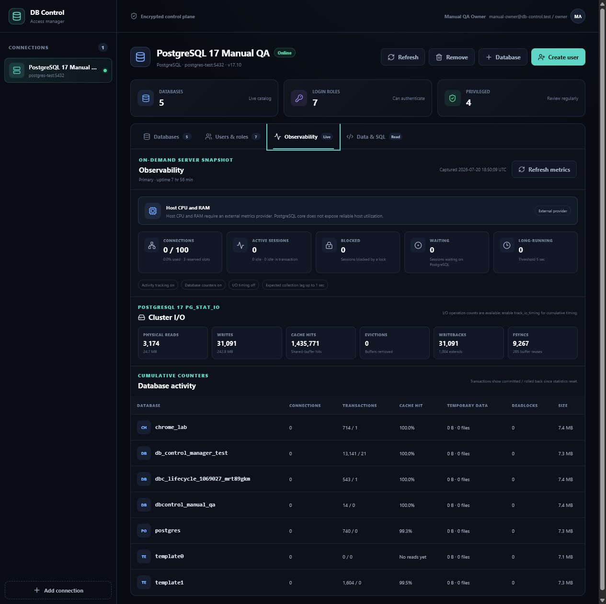

For MySQL, the same tab renders only genuine MySQL data: server uptime and
read-only state, connection capacity, running threads, `Questions`, `Queries`,
bytes sent/received, slow queries, aborted connections, temporary disk tables,
and visible database size/charset/collation. It never labels MySQL values as
PostgreSQL transactions, cache hits, or `pg_stat_io`. Cross-session activity
requires sufficient MySQL `PROCESS`/statistics visibility;
otherwise the section is explicitly restricted.

MySQL SQL also cannot provide trustworthy host/container CPU or RAM. Both
engines show **External provider** for host telemetry until a separately secured
metrics provider is configured.

## 6. Use the guarded Data & SQL workspace

Owners, admins, and operators can open **Data & SQL**. Viewers cannot see or call this workspace. It deliberately does not execute user queries with the saved administrator credential.

1. Choose a database that accepts connections.
2. Choose a restricted principal. PostgreSQL rejects privileged memberships and direct/inherited owners. MySQL rejects current/system/global/grant-option/role/`PROXY` accounts and DDL, routine, trigger, event, temporary-table, or lock authority across every schema.
3. Enter that role's password and select **Open read-only workspace**.
4. Browse relations visible through the role's schema `USAGE` and relation `SELECT` permissions, or run one row-returning PostgreSQL statement.
5. Select **Disconnect & forget password** when finished.

The password remains only in the active browser state, is sent to the same-origin endpoint for each workspace request, and is never saved in SQLite or audit events. Changing the connection/role or disconnecting clears it.

On PostgreSQL, the SQL guard uses the server rather than a regex allowlist.
DBMason sends submitted text without interpolation through `pg-cursor` and the
extended query protocol. PostgreSQL accepts one prepared statement at that
boundary, DBMason requires returned row fields, and a server-side `READ ONLY`
transaction blocks database writes. Native grants and row-level-security still
decide which rows the role may see.

`READ ONLY` is a database-write boundary, not a general process or network sandbox. Revoke `EXECUTE` on untrusted user functions and extensions for the workspace role: an external side effect outside PostgreSQL cannot be undone by `ROLLBACK`.

Workspace limits are intentionally small:

- a row-returning statement and at most 32,768 SQL characters
- a 256 KiB JSON request-body cap
- five-second statement and one-second lock timeout, plus a seven-second hard socket deadline
- 4 MiB transaction-local `work_mem`
- 100-row relation pages and at most 200 query rows; the cursor fetches one extra row only to detect truncation
- catalog capped at 500 relations, offset capped at 100,000
- approximately 1 MiB of serialized rows and 32,768 characters per cell
- a separate budget of two active workspace operations and eight waiting operations

Truncation is shown in the result instead of returning an unbounded payload. The per-cell limit is applied after the PostgreSQL driver decodes a value, so one exceptionally large datum can temporarily allocate more input memory before its displayed form is truncated; this is not an absolute peak-memory bound. Query text, passwords, and returned rows never appear in audit records.

The production browser pass opened the catalog as the restricted login, browsed only the granted relation, and returned its visible rows:

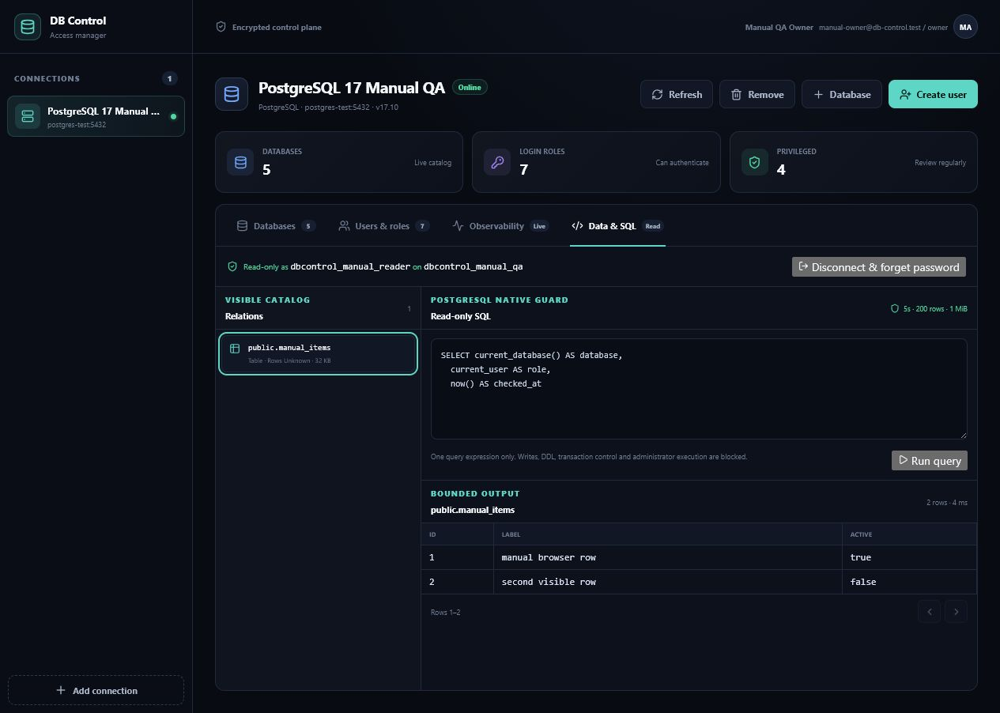

A safe `SELECT` reported the restricted role as `current_user`, confirming that user SQL did not run with the saved administrator credential:

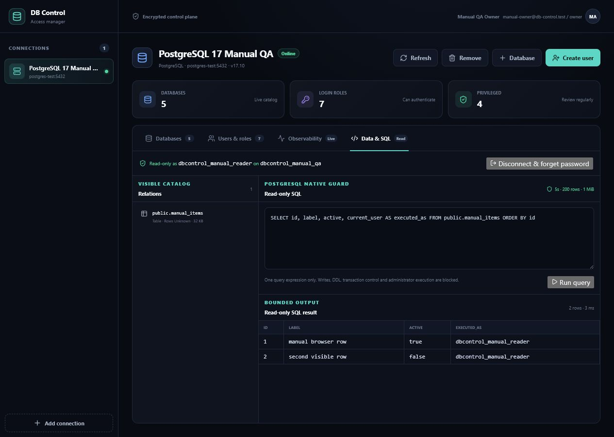

A writable CTE was rejected by PostgreSQL's read-only transaction. A direct PostgreSQL read afterward confirmed that the source row was unchanged:

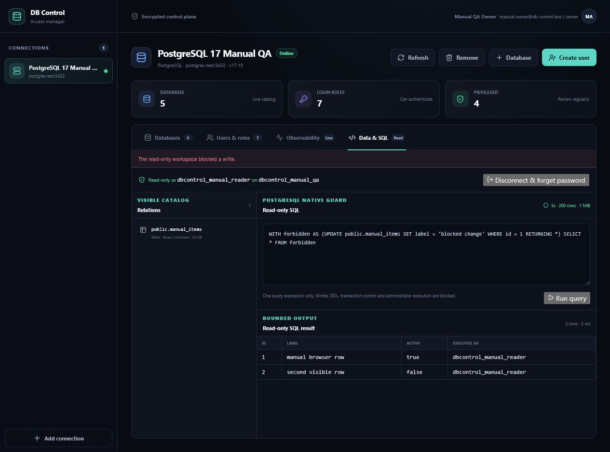

### MySQL workspace behavior

MySQL authenticates the transient account and verifies `CURRENT_USER()` against
the selected `user@host`. It repeats a fail-closed `SHOW GRANTS` check inside
that actual session, permits only `USAGE` plus directly scoped read/DML grants,
disables multiple statements, starts `START TRANSACTION READ ONLY`, and streams
only row-returning results. Write-level accounts may read here because the
transaction contains their DML; developer accounts cannot open the workspace.

Routine execution and temporary-table authority are rejected: MySQL read-only
transactions cannot undo external routine/plugin side effects and can permit
some temporary-table changes. Catalog browsing stays in the selected database,
but a query can read another explicitly qualified schema when the account has a
safe native read grant there. Treat all grants across that account as part of
the confidentiality boundary.

The MySQL adapter uses the same 256 KiB request, 32,768-character query/cell,
200-row, roughly 1 MiB response, two-active/eight-waiting, five-second server,
and seven-second hard-deadline limits. MySQL browser screenshots are not claimed
in this guide until a production/manual evidence pass is recorded.

## 7. Create a database

1. Confirm the selected connection in the left rail.
2. Select **Database**.
3. Enter the new database name. PostgreSQL can also select an existing owner role; MySQL does not have this owner concept and hides/rejects it.
4. Submit and verify the refreshed row.

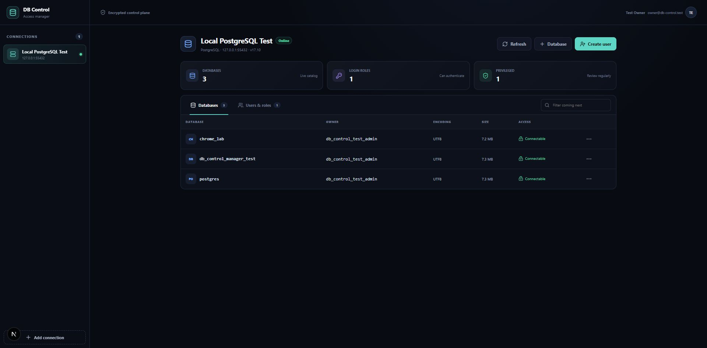

Identifiers are validated and quoted by the selected engine adapter (63-byte
PostgreSQL names, 64-byte MySQL names). DBMason has no arbitrary admin-SQL
endpoint.

## 8. Create a database principal

1. Select **Create user**.
2. Enter a PostgreSQL role name or a complete MySQL `user@host` account.
3. Optionally choose a database and one allowlisted preset: connect, read, write, or developer.
4. Submit, copy the generated password into an approved secret manager, and close the one-time reveal.

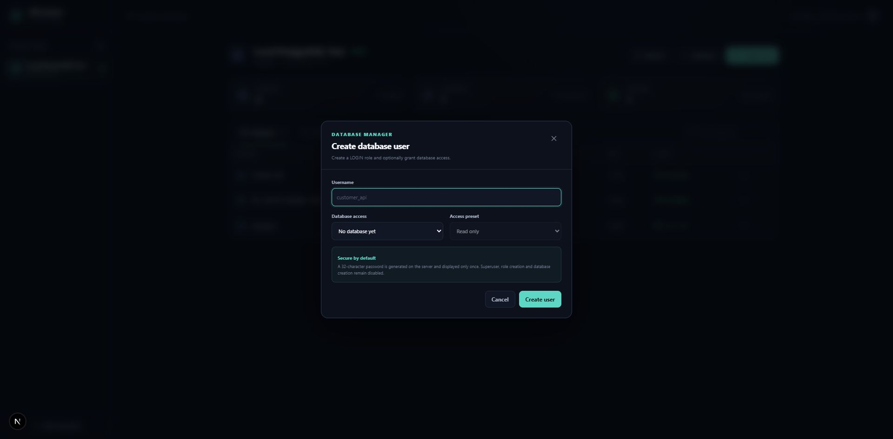

The password is generated on the server, displayed once, and never stored by
DBMason. PostgreSQL receives a SCRAM-SHA-256 verifier; MySQL creates its account
with the engine's configured authentication plugin. Credential reveals are
deliberately absent from screenshots and documentation.

On MySQL, `connect` means authentication-only because MySQL has no per-database
`CONNECT` privilege. `read` grants `SELECT, SHOW VIEW`; `write` adds
`INSERT, UPDATE, DELETE`; `developer` grants database-scoped `ALL PRIVILEGES`
and cannot use the guarded workspace.

If a multi-database creation fails partway through, DBMason removes earlier managed grants and attempts to drop the new role. The real PostgreSQL suite verifies this compensation path.

## 9. Manage an existing principal

Open **Users & roles**, then select the action button for a standard principal.
For PostgreSQL, the active connection role, superusers,
replication/bypass-RLS roles, and roles with elevated create capabilities are
protected from lifecycle mutations. The retained screenshot is PostgreSQL
evidence.

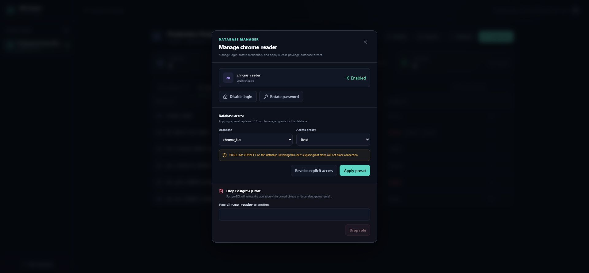

The active management role and any direct, inherited, or `SET`-only member of it, a privileged role, or a `pg_*` role are rejected server-side before every lifecycle mutation.

The dialog supports:

- **Disable/enable login** without discarding the current credential.
- **Rotate password**, which invalidates the old password and shows the replacement once.
- **Apply preset**, which validates the database before replacing DBMason-managed grants.
- **Revoke explicit access**, including default privileges DBMason can safely alter.
- **Drop role**, gated by exact-name confirmation; PostgreSQL refuses the drop while owned objects or dependent grants remain.

PostgreSQL cannot transactionally coordinate two databases. Access replacement therefore fails closed: if applying the new preset fails, partial new grants are cleared and the original safe error is returned.

For MySQL, the complete `user@host` remains visible in every action. The adapter
protects active/system accounts, global privilege holders, schema/table/column/
routine grant-option holders, and both sides of role or `PROXY` edges. Applying
a preset validates and removes direct schema/table/column/routine grants on that
database before granting the replacement. Unknown grant shapes stop safely.
MySQL DCL is not transactional, so an interrupted later step can leave reduced
access; refresh and reconcile before retrying.

## 10. Understand `PUBLIC` access

PostgreSQL commonly grants database `CONNECT` and temporary-table capability to `PUBLIC`. Every role inherits `PUBLIC`, so an explicit revoke is not proof that the role can no longer connect.

DBMason shows effective `PUBLIC` grants in the database table and repeats the caveat in the lifecycle dialog. A revoke response also warns when `PUBLIC` or role membership still permits connection.

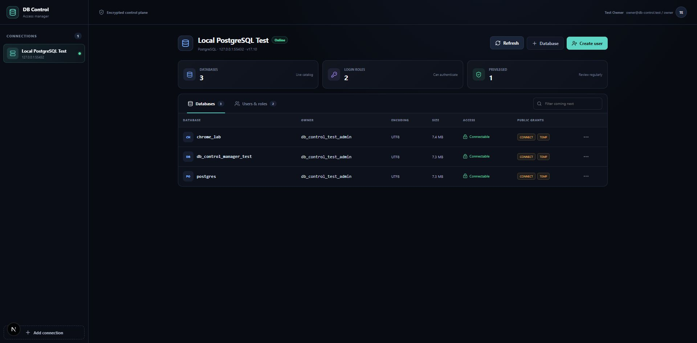

DBMason does not silently change cluster-wide `PUBLIC` defaults because that could break existing applications. Review those ACLs through your organization's approved PostgreSQL change process.

## 11. Give application users read-only access

Owners manage DBMason accounts under Payload Admin **Users**. A `viewer` can inspect saved connections, live inventory, and aggregate observability but cannot open Data & SQL, add/remove a saved connection, create a database, create/manage a remote principal, or read other application-user records.

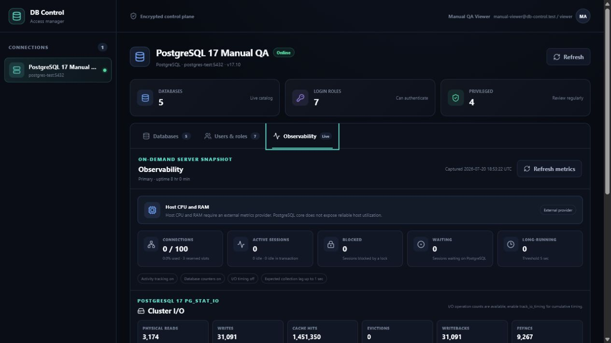

The same viewer flow was checked at a 375-pixel viewport with no horizontal page overflow:

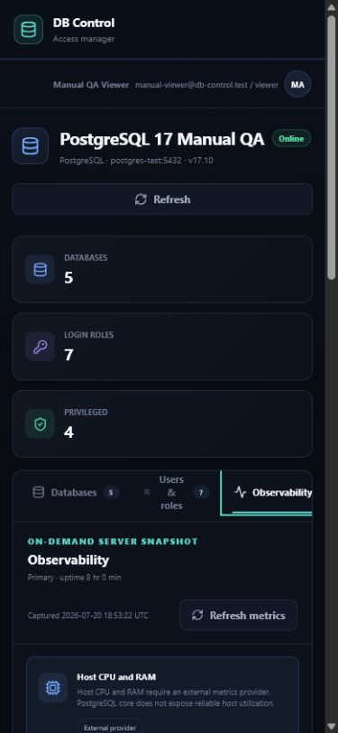

The UI removes mutation controls, and the API independently returns `403` for viewer mutations. Never treat hidden buttons as the authorization boundary.

## 12. Review audit events

Every remote mutation first persists a `requested` event. A terminal `succeeded` or sanitized `failed` event follows. Audit rows contain a request ID, actor, action, safe target, outcome, and duration; they exclude passwords, cookies, DSNs, raw SQL, raw database detail, and stack traces.

Workspace catalog, relation, and query reads use the same requested/terminal audit pattern, but the target contains only safe principal/database/relation identifiers. Submitted SQL, transient credentials, and result data are excluded. Routine observability snapshots are on-demand reads and are not written to the mutation audit log.

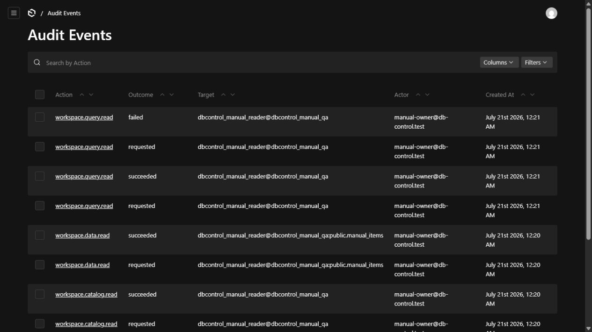

Requested-audit persistence is fail-closed: remote work does not start when the intent record cannot be written. A terminal audit transport failure is logged but does not falsely report an already-completed remote operation as failed.

## 13. Remove a saved connection

Owners and admins can select **Remove**, type the saved connection name, and confirm. This deletes only the encrypted control-plane record. It does not drop remote databases, principals, objects, or grants.

To change a saved administrator password today, create and validate a replacement saved connection before removing the old record. In-place saved credential rotation is a later feature.

## 14. Run the release checks

```bash
pnpm check
pnpm test:postgres
pnpm test:mysql
pnpm test:e2e:mvp
pnpm test:e2e:mysql
pnpm build
```

The real-server and browser suites use isolated test targets and exact test-only
names. The retained production screenshots and manual browser evidence are
PostgreSQL-specific; see the [validation report](VALIDATION_REPORT.md) for the
recorded status of each engine.

Stop the PostgreSQL harness while preserving its volume:

```bash
pnpm postgres:test:down
pnpm mysql:test:down
```

Only when the isolated test data may be destroyed, reset that exact harness:

```bash
pnpm postgres:test:reset
pnpm mysql:test:reset
```

## Troubleshooting

### The application port is already in use

Choose a free `PORT` in `.env` and restart. `pnpm dev:app-test` uses `.env.app-test`, a separate port, SQLite file, and Next output directory.

### PostgreSQL port `55432` is already in use

Stop the harness, change `POSTGRES_TEST_PORT` in `.env.postgres-test`, restart it, and use the same port in DBMason.

### MySQL port `53306` is already in use

Stop the MySQL harness, change `MYSQL_TEST_PORT` in `.env.mysql-test`, restart it,
and use the same port in DBMason. `mysql:test:reset` removes only the dedicated
test volume, but it is still destructive to that test data.

### Connection test fails

Run the matching `postgres:test:status`/`postgres:test:logs` or
`mysql:test:status`/`mysql:test:logs` command. Confirm the engine, host route,
allowlist, maintenance database, username, password, and TLS mode. Production
remote servers should use certificate verification.

### Activity cards say `Restricted`

Aggregate counters can still be valid. PostgreSQL cross-session activity needs
`pg_read_all_stats` (or superuser). MySQL activity needs sufficient
`PROCESS`/statistics visibility. Prefer narrow monitoring
privileges and review their information exposure.

### Host CPU or RAM says `External provider`

This is expected. Neither PostgreSQL nor MySQL core SQL exposes trustworthy
host/container CPU or memory utilization. Configure a separately secured
platform/exporter integration when that feature is added; activity/status is
not a substitute for CPU percentage.

### Data & SQL rejects the selected principal

Use a separate `LOGIN` role without superuser, `CREATEDB`, `CREATEROLE`, replication, `BYPASSRLS`, privileged/`pg_*` memberships, equality with the saved management role, or direct/inherited ownership of the selected database or its non-system relations. Grant only the intended database `CONNECT`, schema `USAGE`, relation `SELECT`, and applicable RLS access.

For MySQL, use a dedicated `user@host` without global privileges, grant option,
role/`PROXY` edges, DDL, routine, trigger, event, temporary-table, or lock
authority on any schema. Only directly scoped read/DML grants pass the transient
session recheck.

### A workspace query is blocked or truncated

The workspace accepts one row-returning statement through the selected engine's
single-statement boundary and always rolls back its five-second read-only
transaction. Writes, DDL, non-row-returning commands, stacked statements,
permission failures, and lock timeouts are intentionally rejected. A
seven-second hard deadline closes a stuck socket. Results stop at 200 rows,
about 1 MiB, or the post-decode per-cell limit; narrow the query instead of
raising the browser payload without a security review.

### A role can connect after explicit access was revoked

Inspect the database's **PUBLIC grants** and the revoke warning. `PUBLIC CONNECT` or role membership may still be effective even when the role's direct grant is gone.

### A role cannot be dropped

PostgreSQL is protecting dependencies. Reassign or remove owned objects and dependent grants through an approved process, refresh DBMason, and retry only when deletion is intended.
